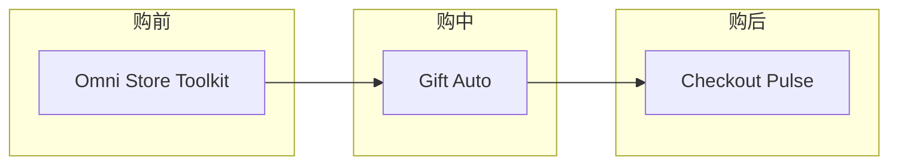
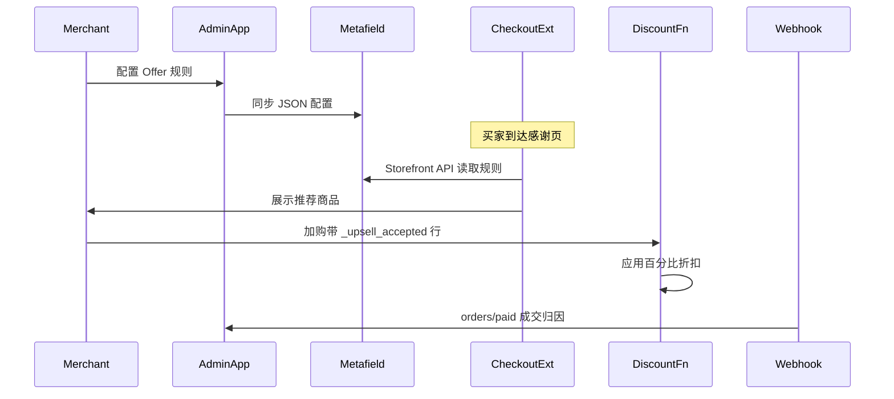

# Checkout Pulse

购后追加销售 Shopify App：**感谢页 Offer**、**Discount Function 自动折扣**、**转化分析仪表盘**。基于 Remix + Checkout UI Extension + Shopify Functions，与 [Omni Store Toolkit](https://github.com/Alohamonde/omni-shopify-app)（购前店面）和 Gift Auto（购中赠品）形成差异化技术矩阵。


## 功能

| 模块 | 说明 |
|------|------|
| **购后追加销售** | Checkout UI Extension 在感谢页 / 订单状态页展示规则驱动的推荐商品 |
| **追加购折扣** | Discount Function 对带 `_upsell_accepted` 标记的购物车行自动应用百分比折扣 |
| **转化仪表盘** | 追踪展示、点击与 `orders/paid` 成交归因 |

## 与现有项目的差异化

| 项目 | 场景 | 核心技术 |
|------|------|----------|
| Omni Store Toolkit | 购前店面 | Theme Extension、App Proxy、批量编辑 |
| Gift Auto | 购中购物车 | Theme Extension、赠品 Discount Function |
| **Checkout Pulse** | **购后 Checkout** | **Checkout UI Extension、Discount Function、Webhooks** |



## 技术栈

- Remix + React + TypeScript
- Shopify Polaris + App Bridge
- Prisma + SQLite
- Checkout UI Extension（`purchase.thank-you` + `customer-account.order-status`）
- Shopify Discount Function（JavaScript → WASM）
- Shop Metafields（`$app:checkout_pulse`）+ App Proxy 统计上报
- Shopify Admin GraphQL API

## 架构



## 快速开始

### 环境要求

- Node.js 20+
- [Shopify Partner](https://partners.shopify.com) 账号
- [Shopify CLI](https://shopify.dev/docs/apps/tools/cli)

### 安装运行

```bash
git clone <your-repo-url>
cd checkout-pulse
cp .env.example .env
npm install
npm run setup
npm run dev
```

首次 `npm run dev` 会引导你登录 Partner、创建 App、选择开发商店。

### 店面启用

1. 在 **结账编辑器** 中启用 **Thank You Upsell** 区块（感谢页）
2. 在 **客户账户订单状态** 中启用同一扩展（可选）
3. 在 App 后台 **Offer 规则** 中创建触发条件与推荐商品

### 测试追加购流程

1. 配置一条规则（例如：购买商品 A → 推荐商品 B，15% 折扣）
2. 完成一笔包含触发商品的测试订单
3. 在感谢页点击「立即加购」
4. 新购物车行应带 `_upsell_accepted=1` 属性，结账时自动打折

## 项目结构

```text
app/routes/
  app._index.tsx                 # 总览 + KPI
  app.offers.tsx                 # Offer 规则 CRUD
  api.track.tsx                  # Checkout Extension 统计（Session Token）
  apps.checkout-pulse.track.tsx  # App Proxy 统计
  webhooks.orders.paid.tsx       # 成交归因
app/models/
  offers.server.ts               # 规则 + Metafield 同步
  upsell-discount.server.ts      # 自动折扣管理
extensions/
  thank-you-upsell/              # Checkout UI Extension
  upsell-discount/               # Discount Function + 单元测试
prisma/schema.prisma             # Session + OfferRule + OfferEvent
```

## 开发命令

```bash
npm run dev                              # 启动 App + 扩展开发
npm run build                            # 构建 Remix 应用
npm run deploy                           # 部署 App 与扩展

cd extensions/upsell-discount
npm run build                            # 构建 Function WASM
npm test                                 # 运行 Function 单元测试
```

## Roadmap

- Plus 商户：结账步骤内 Upsell Block（`purchase.checkout.block.render`）
- 按市场 / 币种差异化规则（Markets API）
- Customer Account UI Extension 复购快捷入口

## License

MIT
